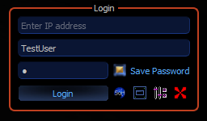
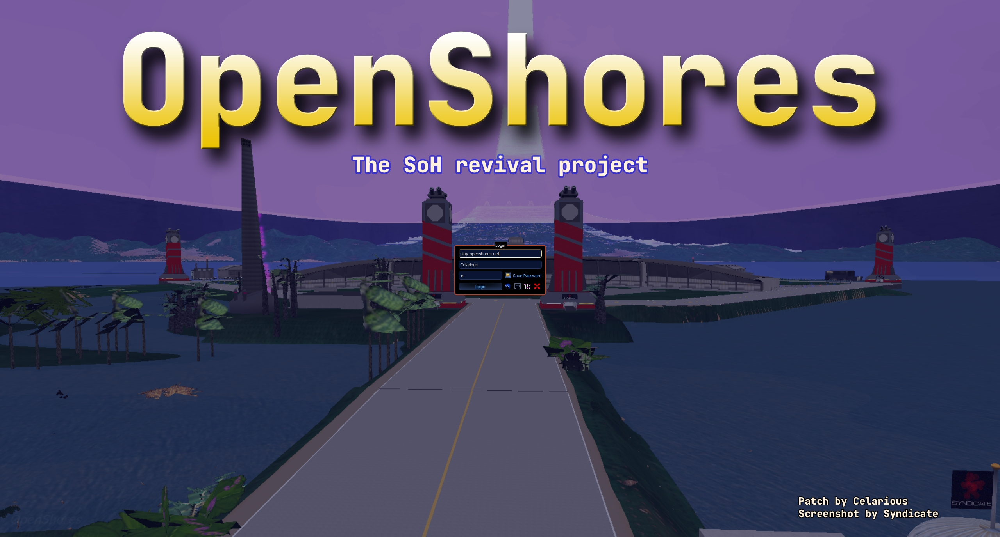

# OpenShores-IP-Patch
A client modification for the 2018 (13n60) Shores of Hazeron MMO that adds an IP address input field, redirects connections from the hardcoded *.hazeron.net to the entered IP address (or hostname), provides a client interface for easy future modding without the need of more ASM patches, and more.

# How to use
The recommended way is to use the OpenShores launcher, which automatically downloads the correct SoH client and applies the IP patch:
https://github.com/Norway174/OpenShores-Launcher/releases/

# Features
* Divides the game process into logical states through SetState() with hooks and events. Custom C++ logic is done depending on the active state
* Adds a functional IP input field on the login screen
* Stores the user's entered host in the registry and prefills the field on client restart for convenience
* Replaces the login screen background with Background.png, allowing easy customizaton
* Adds handling of the -nologin launch argument. If passed, it simulates a Login click and automatically logs the user in directly from the OpenShores launcher
* Customizes the scrolling text on the login screen
* Customizes the window icon and window title
* Resolves the game's existing imported functions through their IATs and creates easy helpers for repurposing

# Notes
As of V0.0.5, all client modification functionality has been ported to a client interface DLL written in C++. ASM is only used to call SetState() of that DLL and pass relevant registers if necessary. 

When calling Qt functions in custom DLLs, the ABI must match the original program, which requires the same exact Qt SDK as the original client (Qt 5.8.0), along with MSVC v140 (VS2015). Our custom DLLs are thus built with MSVC v140 linked against Qt5.8.0.

The .cave PE sections are added with CFF explorer, and it's very small, meaning the exe does not meaningfully increase in size

This was my first reverse engineering/asm project of any kind, I fumbled my way through all of it with the help of chatgpt

See [notes](/docs/notes.md) for more details

# Screenshot
 
